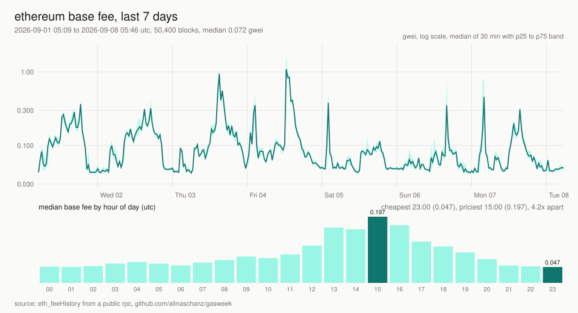

# gasweek

[](https://github.com/alinaschanz/gasweek/actions/workflows/ci.yml)
[](https://github.com/alinaschanz/gasweek/actions/workflows/daily.yml)


[](https://github.com/alinaschanz/gasweek/releases)

when is ethereum cheapest? the base fee of every block in the last week, binned by hour
of day and by weekday, as a table and as an svg. from `eth_feeHistory` on a public rpc,
no keys, nothing to install.



the chart above is rebuilt every night by the [daily workflow](.github/workflows/daily.yml),
which also appends one row per day to [data/daily.csv](data/daily.csv).

```
$ gasweek --tz +2
ethereum base fee, 50,400 blocks (25,878,924 to 25,929,323), 2026-09-01 00:44 to 2026-09-08 01:20 utc
overall  min 0.029  p25 0.050  median 0.072  p75 0.120  p90 0.202  max 2.11 gwei  |  blob median 0.004 gwei
blocks were 51% full on average

hour (utc+2)  median     p25     p75
00:00        0.050   0.045   0.058  ######
01:00        0.047   0.044   0.050  ######
02:00        0.048   0.045   0.053  ######
03:00        0.048   0.044   0.061  ######
04:00        0.052   0.045   0.099  ######
05:00        0.060   0.049   0.085  #######
06:00        0.064   0.049   0.092  ########
07:00        0.059   0.048   0.070  #######
08:00        0.052   0.047   0.061  ######
09:00        0.060   0.049   0.080  #######
10:00        0.068   0.058   0.090  ########
11:00        0.078   0.054   0.110  ##########
12:00        0.074   0.047   0.113  #########
13:00        0.085   0.049   0.108  ##########
14:00        0.110   0.084   0.147  #############
15:00        0.164   0.087   0.246  ####################
16:00        0.159   0.097   0.263  ###################
17:00        0.197   0.095   0.309  ########################
18:00        0.171   0.121   0.290  #####################
19:00        0.122   0.090   0.180  ###############
20:00        0.108   0.079   0.153  #############
21:00        0.090   0.073   0.137  ###########
22:00        0.071   0.057   0.103  #########
23:00        0.052   0.046   0.063  ######

cheapest hour  01:00-02:00 utc+2  median 0.047 gwei
priciest hour  17:00-18:00 utc+2  median 0.197 gwei  (4.2x)

weekday  median
mon        0.063  ##############
tue        0.092  ####################
wed        0.107  ########################
thu        0.091  ####################
fri        0.092  #####################
sat        0.057  #############
sun        0.055  ############
```

that week the answer was: berlin night, or the weekend. the us afternoon costs four times
the berlin night, and even then the whole range sits under a quarter of a gwei.

## install

```
pipx install git+https://github.com/alinaschanz/gasweek
```

or clone it and run `python -m gasweek` from the folder. python 3.10 or newer, no dependencies.

## use

```
gasweek                              # last 168 hours, hours in utc
gasweek --tz +2                      # hour-of-day table in berlin summer time (+1 in winter)
gasweek --hours 24                   # just yesterday
gasweek --svg fees.svg               # the chart
gasweek --csv blocks.csv             # every block: number, timestamp, base fee, gas used ratio, blob fee
gasweek --json                       # the summary as json
gasweek --summary-append daily.csv   # one row per run, header written once
gasweek --tips                       # plus the priority fees people actually paid, p10/p50/p90 per block
gasweek --rpc https://your.node      # your own endpoint first
```

`--tips` asks `eth_feeHistory` for reward percentiles; the table gets a `tip p50` column per hour and
the csv three tip columns, which answers "what do i set as priority fee at this hour" without a second
tool. the answers are bigger, so a full week takes about twice as long.

a full week is 50,400 blocks, fetched as 50 pages of 1024 in parallel; it takes a minute
or two on a public node.

## how it works

- [`eth_feeHistory`](https://ethereum.github.io/execution-apis/api-documentation/) returns the
  base fee per block (the [eip-1559](https://eips.ethereum.org/EIPS/eip-1559) one), the gas
  used ratio and, since cancun, the blob base fee. it does not return timestamps.
- so one block header per page is fetched and the blocks in between are interpolated;
  post-merge blocks are 12 s apart except for missed slots, which keeps the error inside a
  page under a minute. `fees.py` has the arithmetic.
- percentiles are plain order statistics with linear interpolation; hour and weekday bins
  follow `--tz`. the chart is a string of svg elements: a log-scale line of 30 minute
  medians with a p25-p75 band, and the hour-of-day medians as bars.
- endpoints: publicnode, drpc, mevblocker, tenderly, blastapi, in that order.

## the dataset

`data/daily.csv` gets a row per day at 00:17 utc: min, p25, median, p75, p90 and max base
fee of the previous 24 hours, cheapest and priciest hour, average block fullness, median
blob fee. columns are described in [data/README.md](data/README.md). it starts on
2026-09-08; if you want the same numbers for an older window, `gasweek --hours N
--summary-append` reproduces a row from any node that still serves the history.

every monday morning a workflow posts the week as a
[discussion](https://github.com/alinaschanz/gasweek/discussions): the seven daily rows and the
hour-of-day table from a fresh run. `.github/scripts/weekly_report.py` is the whole of it.

## see also

- [onchain-notes](https://github.com/alinaschanz/onchain-notes): `gas_now.py`, the same fee market as a cost per action, right now
- [bigmoves](https://github.com/alinaschanz/bigmoves), [stablepeg](https://github.com/alinaschanz/stablepeg), [ens-lookup](https://github.com/alinaschanz/ens-lookup)
- the notes: [alinaschanz.life](https://alinaschanz.life), the short version on [x](https://x.com/alinaschanz)

## license

[mit](LICENSE)
